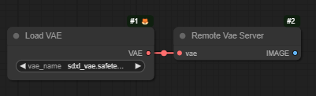

# Offload latent

A set of nodes to allow you to send a latent to another machine (or a separate instance of Comfy on the same machine, I guess, using a different GPU) 
to be decoded (or to run a whole second workflow). The main workflow can either wait for it to be returned, forget about it, or do a deferred save.

## Modes of operation

- *Wait* - the latent is sent to the server, and the client waits for it to be returned. The only benefit to this is if your are
close to VRAM limits (who isn't?), so saving the time offloading and loading models.

- *Forget* - the latent is sent to the server, and the client can get on with the next run. The second machine will decode it to an image (and can then do whatever else you want)

- *Promise* - the latent is sent to the server, and the node returns a 'PROMISE'. The `Save Promised Image` node will save the image when it becomes available, but won't stop other nodes from running.

## How?

These nodes require two instance of Comfy to be running. I'm assuming they are on different machines. They must be running the same version of torch, but don't need to be the same operating system (at least, I've run it with as Linux server and Windows client).

### Server

The server is the machine which will do the VAE decoding (and not the main workflow). Start up ComfyUI, with the `--listen` option so that you can call it from another machine. The server has a workflow which looks like this:

Optionally, you can also connect a save image node to the output (or add a whole extra workflow here if you want!).

Select `Auto Queue` in the settings, and then `Queue Prompt` to start the server. It will wait in the Server node until it is called, then 
decode the latent it receives into an image.

The image will be sent to its output (so you could save it, or even do a whole second workflow with it), and returned to the client (unless it was in *Forget* mode).

_To Do_ add an optional timeout so the server node exits if it doesn't get an input.

### Client

The client has a latent as its input, and two outputs, IMAGE and PROMISE. You enter the address of the server instance of Comfy into the server box and select a mode.

In *Wait* mode, it's used just like `Decode VAE` - it sends the latent to the server, and waits to get the image back. The `PROMISE` output is not used.

In *Forget* mode it sends the latent and then exits. Neither output is used. Hopefully your server is doing something with the image...

In *Promise* mode it sends the latent to the server and then *immediately* returns a `Promise`. The `Image` output is not used. At the moment the opnly thing you can do with a 